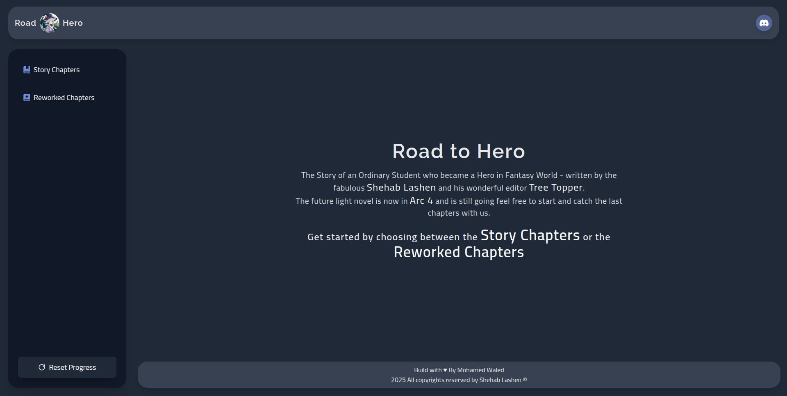
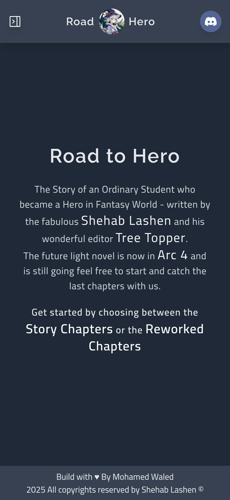

# Road to Hero

An online reading platform for serialized light novels. Chapters are retrieved straight from the novel's server using a Node.js-powered Discord bot, which arranges them in an orderly and easily navigable manner. Additionally, the website has a tracking feature that lets users easily keep tabs on their progress. Ideal for people who prefer a simplified reading experience with integrated progress monitoring!

## Table of contents

- [Overview](#overview)
  - [Screenshot](#screenshot)
  - [Links](#links)
- [My process](#my-process)
  - [The idea](#the-idea)  
  - [Built with](#built-with)
- [Author](#author)

## Overview

### Screenshot

### Links

- Live Site URL: [Live site URL here](https://road-to-hero.vercel.app/)

## My process

## The idea

The main idea behind this site is to make reading the **Road to Hero** novel easier. This novel was originally published on a Discord server. The author opened a server, set up a channel, and started writing his novel. I found it hard to read and keep track of what I had finished, and every time I needed to scroll through a ton of messages to find where I had stopped. So, I got an idea: why not build a Discord bot that fetches the messages (i.e., story chapters) from the channel, organizes them by removing the white spaces, and arranges them in order? Then, I could build an API to GET these chapters and put them into this application, creating a better user experience with simple tracking functionality. Voilà! An easier life for me and the readers of this novel!

> [!NOTE]
> The author of the novel is a friend of mine, so before I even started this project, I asked for his permission, and he granted it to me!

### Built with

- HTML5
- React.js
- Next.js
- TypeScript
- Tailwind Css
- npx create-next-app
- npm
- API
- WebStorm

## Author

- Linkedin - [@mohamed-waled](https://www.linkedin.com/in/mohamed-waled)